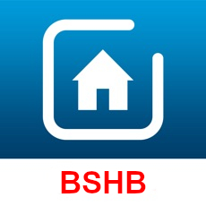

[](https://www.npmjs.com/package/bosch-smart-home-bridge)
[](https://www.npmjs.com/package/bosch-smart-home-bridge)
[](https://github.com/holomekc/bosch-smart-home-bridge/actions/workflows/test.yml)
[](https://snyk.io/test/github/holomekc/bosch-smart-home-bridge)

[](https://nodei.co/npm/bosch-smart-home-bridge/)

# bosch-smart-home-bridge

Allows communication to Bosch Smart Home Controller (BSHC)

[Bosch Smart Home Controller](https://www.bosch-smarthome.com/de/de/produkte/smart-system-solutions/smart-home-controller)

[Bosch Smart Home Controller Local REST API](https://github.com/BoschSmartHome/bosch-shc-api-docs).

## Getting started

You need to create a new instance of BoschSmartHomeBridge (BSHB). Therefore, you need to use BoschSmartHomeBridgeBuilder.
The builder will force you to set every mandatory properties:

- host name / ip address of BSHC
- client certificate (base64 encoded)
- client private key (base64 encoded, 2048bit)
- a logger which implements the interface which is defined in this library (optional)

```typescript
const certificate = BshbUtils.generateClientCertificate();
const bshb = BoschSmartHomeBridgeBuilder.builder()
  .withHost("192.168.0.10")
  .withClientCert(certificate.cert)
  .withClientPrivateKey(certificate.private)
  .build();
```

## Pairing

Then you need to start the pairing process. Therefore, you need:

- name of the client
- a unique identifier for the new client (uuid is ok but can be any string)
- system password of BSHC

```typescript
const identifier = BshbUtils.generateIdentifier();
bshb.pairIfNeeded("name", identifier, "systemPassword");
```

## Communication

After that you can use BSHB to communicate with BSHC. Therefore, just use the provided client which provides
some helpful methods:

```typescript
bshb.getBshcClient();
```

## Long Polling

If you are interested in updates from bshc you can use long polling. Therefore, you need to do the following:

```typescript
bshb
  .getBshcClient()
  .subscribe()
  .subscribe((response) => {
    bshb
      .getBshcClient()
      .longPolling(response.parsedResponse.result)
      .subscribe((info) => {
        // do something with the information
        // also you need to call longPolling again after connection close
      });
  });
```

Do not forget to unsubscribe. E.g. in error case or on application end.

```typescript
bshb
  .getBshcClient()
  .unsubscribe(response.parsedResponse.result)
  .subscribe(() => {});
```

## Examples

You can find an example in test directory. Npm arguments must be set manually.
